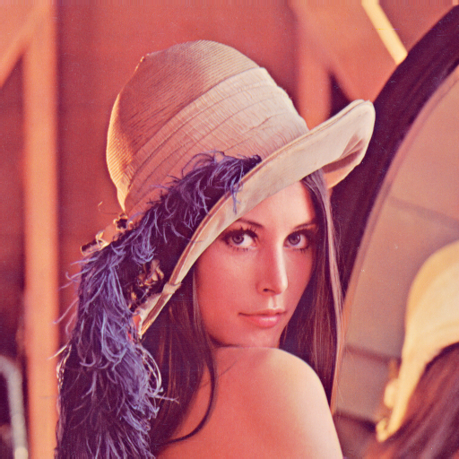
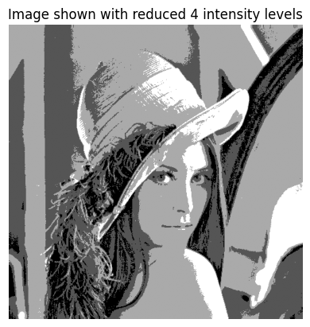
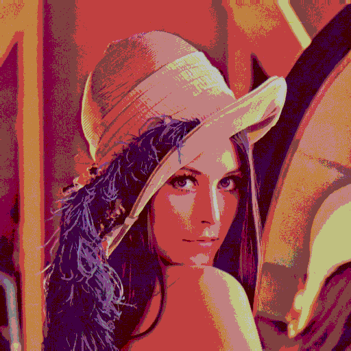
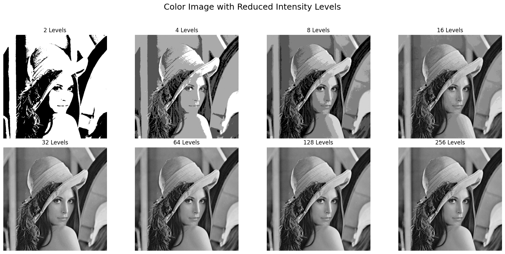
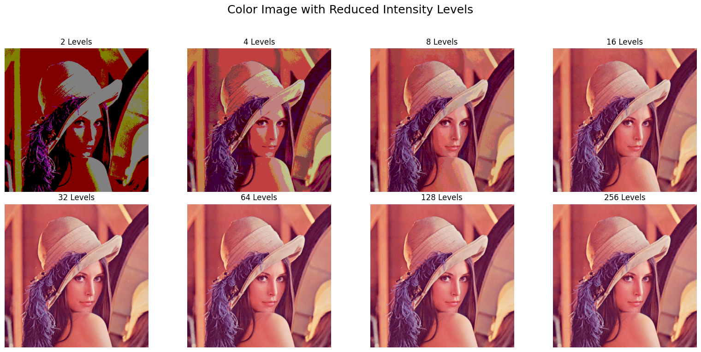
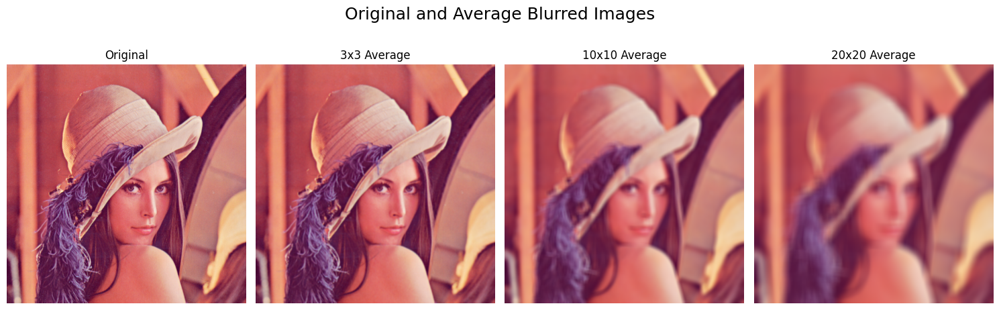
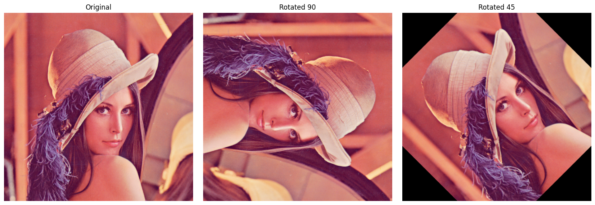

# EC7212 - Computer Vision and Image Processing

# Take Home Assignment 1

### ✅ * Load the Image from Google Drive
  

---

## 📝 Tasks

### ✅ Task 01. Reduce Intensity Levels
Reduce the number of intensity levels in an image from 256 to a specified value (like 2, 4, 8, etc.) in integer powers of 2.

- Both grayscale and color images were used.
- Variable `levels` can be used for reduction.

#### ▶️ Outputs:
- **Grayscale**

  

- **RGB**

  

- **Intensity Level Collection (Grayscale)**

  

- **Intensity Level Collection (RGB)**

  

---

### ✅ Task 02. Spatial Averaging (3×3, 10×10, 20×20)

Apply average blurring to smooth the image using neighborhood sizes of 3×3, 10×10, and 20×20.

#### ▶️ Output:

---

### ✅ 3. Rotate Image (45 degrees and 90 degrees)

Rotate the input image by:
- 90 degrees using OpenCV's rotation utility
- 45 degrees using affine transformation

#### ▶️ Output:

---

### ✅ 4. Block-wise Spatial Resolution Reduction

For each non-overlapping block (3×3, 5×5, 7×7):
- Replace all pixels in the block with their average value.

#### ▶️ Output:

---

### 💻 Tools Used

- Google Colab
- Python 3
- OpenCV
- NumPy
- Matplotlib
